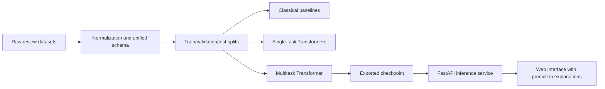

# A Multitask Transformer and Web System for Joint Sentiment Analysis and Review Authenticity Detection in E-Commerce: A Controlled Low-Resource Study

## Abstract

This paper addresses the joint analysis of review sentiment and review authenticity in e-commerce. The problem is important because online retail platforms depend not only on identifying whether customer feedback is positive or negative, but also on determining whether that feedback is trustworthy. A highly accurate sentiment model may still produce misleading business signals if a significant share of the input reviews is deceptive, manipulated, or generated automatically. In practice, sentiment analysis and review authenticity detection are often implemented as separate pipelines, which increases maintenance cost, duplicates infrastructure, and prevents potential knowledge transfer between the two tasks.

To address this limitation, the paper develops a multitask Transformer-based approach with a shared encoder and two task-specific classification heads: one for sentiment classification and one for authenticity detection. The broader dissertation data plan includes Russian e-commerce sentiment resources (`RuReviews`, `Perekrestok Reviews`), the classical `OpSpam` deceptive review benchmark, the `FraudDataset (Yelp)` benchmark for fraud-related authenticity signals, and `MAiDE-up` for AI-generated fake review detection. However, the completed repository snapshot and the completed pilot evidence are narrower: the current reported experiments use only sampled subsets of `RuReviews` and `MAiDE-up`, while `Perekrestok Reviews` is locally prepared for the next stage, `OpSpam` is not yet locally prepared in this workspace, and `FraudDataset` remains a planned extension. Because no single public dataset provides complete high-quality labels for both tasks at scale, the work introduces a unified partially labeled schema that supports heterogeneous datasets within one training pipeline.

Beyond the modeling component, the study develops a reproducible end-to-end system that covers data normalization, baseline training, single-task Transformer baselines, multitask training, model export, API-based inference, and a web interface for interactive review analysis. The broader workflow is explicitly human-in-the-loop: the system is meant to support research and moderation judgment, not to replace it or to mask uncertainty. On a fixed controlled low-resource corpus of `2,000` reviews, repeated runs across `3` train seeds show asymmetric transfer rather than uniform multitask gains. For authenticity detection, the multitask model reached `0.9160 +/- 0.0524` test macro-F1 and showed the strongest result within the tested protocol relative to both the authenticity-only Transformer and the classical baseline. For sentiment, multitask macro-F1 remained statistically indistinguishable from the single-task Transformer but significantly worse than the classical baseline. These findings should therefore be interpreted as bounded empirical evidence about conditional transfer, not as a benchmark-level claim of general multitask superiority.

**Keywords:** sentiment analysis, review authenticity detection, fake review detection, multitask learning, Transformer, e-commerce, multilingual NLP, multilingual encoder, web system.

## 1. Introduction

User reviews are one of the most influential information sources in digital commerce. They affect product ranking, merchant reputation, customer trust, and purchase decisions. For this reason, automatic review analysis has become a standard NLP application in e-commerce. Most existing systems focus on sentiment analysis, that is, identifying whether a review expresses a positive, neutral, or negative opinion.

However, real-world e-commerce review analysis cannot rely on sentiment alone. Platforms increasingly face deceptive, incentivized, spam-like, or automatically generated reviews. When such reviews are not filtered, the resulting sentiment signal may be technically correct for the text itself but analytically misleading for the underlying business reality. In other words, a system that detects polarity but ignores authenticity may still support the wrong decision-making process.

This observation suggests that review sentiment and review authenticity are related tasks rather than isolated ones. Both operate on the same text input, both depend on lexical, semantic, and stylistic signals, and both influence downstream trust and analytics. Despite this connection, most deployed systems still train separate models for sentiment analysis and authenticity detection. This separation is understandable from a practical standpoint, but it increases inference cost, duplicates system complexity, and does not exploit potential positive transfer between related tasks.

The goal of this study is therefore to develop a multitask Transformer-based model and a web system for joint sentiment analysis and review authenticity detection in e-commerce. The work combines a research contribution and an engineering contribution. On the research side, it evaluates whether a shared Transformer encoder with task-specific heads can improve or stabilize performance across both tasks. On the engineering side, it proposes a reproducible data-to-service pipeline that connects dataset normalization, model training, checkpoint export, API inference, and a browser-based user interface. Importantly, the present article reports a bounded empirical study: it argues that the current evidence is sufficient to evaluate transfer behavior under one low-resource mixed-source protocol, but not to support a benchmark-level superiority claim. Substantive interpretation, methodological responsibility, and final claims remain the researcher's responsibility rather than the model's.

## 2. Related Work

The prior literature relevant to this study can be grouped into four intersecting strands: multitask learning in NLP, authenticity-oriented review analysis, realistic review sentiment analysis, and explainability for moderation systems. The present work sits at the intersection of these strands rather than belonging fully to any one of them.

The first strand is multitask learning itself. Classical work showed that related tasks can improve one another through shared inductive bias and regularization [1]. In the Transformer era, BERT established a strong general-purpose text encoder [2], while MT-DNN demonstrated that a shared encoder with task-specific heads can remain effective across multiple downstream tasks within one fine-tuning framework [3]. More recent surveys, however, stress an important limitation: positive transfer depends on task relatedness, supervision density, optimization dynamics, and parameter-sharing strategy rather than arising automatically from hard sharing alone [1]. This matters directly for the present study, because the article does not assume that joint sentiment and authenticity learning must benefit both tasks equally.

The second strand concerns review authenticity detection. Early deceptive-opinion-spam work turned fake-review detection into a benchmarkable NLP problem and established the classical truthful-versus-deceptive framing [4]. Later work moved toward transfer-aware and data-scarce settings. Hai et al. showed that deceptive-review detection can benefit from task relatedness and unlabeled data across domains, which is especially important when authenticity labels are sparse and fragmented [5]. Resources such as `DecOp` further widened the empirical landscape by showing that deception detection must increasingly be studied in multilingual and multi-domain settings rather than only in one narrowly controlled benchmark [6]. Further studies broadened the meaning of authenticity itself. Daryani and Caverlee highlighted hijacked reviews, where text may be linguistically plausible but semantically mismatched to the product context [7]. In industry, Nayak and Garera showed that unified BERT-based moderation can be operationally valuable for e-commerce pipelines [8]. Together, these studies suggest that authenticity is better understood as a family of trust-related review problems than as one stable binary benchmark.

The third strand is AI-generated review detection. The rise of large language models changed the threat model substantially: fluent synthetic reviews are now a scalable manipulation vector rather than an edge case. Liyanage et al. showed that LLM-generated hotel reviews form a distinct detection challenge rather than a trivial extension of older deceptive-review settings [9]. This line was strengthened by `MAiDE-up`, a multilingual benchmark demonstrating that detection difficulty varies across languages, locations, and sentiment strata [10]. Related work around `DetectAIRev` further indicates that cross-generator and cross-domain robustness remains weak even when within-benchmark performance appears strong [11]. For this article, that is important because authenticity supervision is heterogeneous not only across datasets, but also across the underlying phenomena being labeled.

The fourth strand is sentiment analysis on realistic review corpora. Large-scale datasets such as `Amazon Reviews 2023` and multilingual resources such as `MARC` show the importance of naturalistic review text, rating-derived supervision, and cross-lingual evaluation for commerce-oriented sentiment modeling [12, 15]. For Russian-language experimentation, `RuReviews` and `Perekrestok Reviews` provide a useful combination of direct sentiment labels and large in-domain retail text [13, 14]. These corpora make visible a recurring asymmetry in public data: sentiment supervision is relatively easy to obtain at scale, whereas authenticity supervision is rarer, noisier, and more semantically diverse.

An applied concern that cuts across all four strands is explainability. In moderation or trust-and-safety settings, a bare class label is often insufficient. Recent work on explainable fake-review detection argues that analyst-facing systems should expose transparent confidence patterns and interpretable support signals even when they do not provide fully causal explanations [16]. This motivates the lightweight transparency layer in the present repository, although that layer is treated as an engineering aid rather than as the article's core scientific contribution.

Taken together, the literature suggests a narrower and more concrete gap than a generic ``need for multitask learning.'' Shared-encoder multitask architectures are already well established. Authenticity detection across deceptive reviews has also been studied, including transfer-aware formulations. Production moderation systems likewise exist. What remains insufficiently studied is the combination of these elements into one review-level learning problem under partial supervision, where sentiment and authenticity labels come from different public corpora, authenticity itself spans non-identical benchmark semantics, and the empirical claim must remain tightly bounded to the executed protocol. The present article is positioned as a reproducible study of precisely that setting.

## 3. Problem Definition and Research Hypotheses

Let a review text be denoted by `x`. The system must predict two related targets:

1. `y_s`, the sentiment class, where `y_s ∈ {negative, neutral, positive}`;
2. `y_a`, the authenticity class, where `y_a ∈ {authentic, fake}`.

An important challenge is that publicly available datasets rarely provide both labels for the same review at scale. As a result, the learning setup must support partially labeled records, where a review may be annotated for only one of the two tasks.

The main research hypothesis is that joint learning with a shared Transformer encoder will:

- preserve competitive performance for sentiment classification relative to a single-task Transformer baseline;
- improve or stabilize authenticity detection through richer shared language representations;
- produce a more compact and practically deployable inference system than two independent models.

The paper investigates the following specific hypotheses:

- `H1`: the multitask model does not underperform the single-task Transformer on sentiment analysis;
- `H2`: the multitask model outperforms text-only baselines for authenticity detection;
- `H3`: joint training improves robustness only if it improves at least two of the following slice-based indicators on the same protocol: mean source-wise Macro-F1, worst-slice Macro-F1, and the best-minus-worst robustness gap.

The explanation-aware API is treated as an engineering feature rather than a standalone scientific hypothesis. Its role is to improve usability and traceability of predictions in the deployed system, while empirical claims about interpretability must be evaluated separately through calibration analysis or user studies.

## 4. Research Contribution and Novelty

The scientific contribution of the work can be summarized in four points.

1. It studies a unified review-level multitask setup for sentiment analysis and authenticity detection under partial supervision.
2. It proposes a unified data schema that allows heterogeneous public datasets to be combined within a single training and evaluation pipeline.
3. It defines an authenticity-benchmark expansion path that will eventually cover several threat models, including deceptive reviews, platform-level fraud signals, and AI-generated reviews.
4. It complements the modeling study with a deployable API and web application that make the experimental pipeline reproducible end to end.

From a positioning perspective, the article addresses a gap between two research directions that are still often treated independently: review sentiment modeling and review authenticity detection. More precisely, the contribution is the combination of a shared-encoder multitask architecture, a partially labeled heterogeneous corpus design, and a deployable end-to-end workflow for trust-aware review analysis. The point is not to claim that the present pilot solves the full benchmark problem, but to define a reproducible and empirically auditable way to study when joint learning helps one task more than the other.

## 5. Data and Experimental Materials

To keep the study both realistic and reproducible, the experimental framework is built around real and publicly accessible datasets with different label semantics, languages, and domains.

| Dataset | Rows in current local preparation | Language | Domain | Task Signal | Label Provenance | Role in the Study |
|---|---:|---:|---|---|---|---|
| `RuReviews` | `60,602` | RU | e-commerce | 3-class sentiment | direct sentiment labels | integrated locally and used in the current study |
| `Perekrestok Reviews` | `642,682` | RU | grocery retail | rating-derived sentiment | heuristic mapping from ratings | integrated locally, reserved for the expanded benchmark |
| `FraudDataset (Yelp)` | not yet integrated locally | EN | local commerce | authenticity | platform-derived silver fraud labels | planned authenticity benchmark, not used in the current study |
| `OpSpam` | not yet integrated locally | EN | hospitality | authenticity | gold deceptive-vs-truthful labels | planned authenticity benchmark, not used in the current study |
| `MAiDE-up` | `19,985` | multilingual | hospitality | authenticity | real-vs-AI-generated labels | integrated locally and used in the current study |
| `Amazon Reviews 2023` | optional | EN | e-commerce | sentiment / metadata | ratings + metadata | optional transfer extension, not part of the current study |

This combination is necessary because no single public dataset currently offers both large-scale e-commerce sentiment labels and highly reliable authenticity annotations in one unified benchmark. Rather than hiding this limitation, the study explicitly embraces it by constructing a unified multitask corpus from several complementary resources. However, the completed pilot reported here is narrower than the full data plan: only `RuReviews` and `MAiDE-up` are used in the current empirical comparison, `Perekrestok Reviews` is prepared locally for the next benchmark stage, `OpSpam` has a code-level adapter but no local prepared copy in the current workspace snapshot, and `FraudDataset` remains a planned integration rather than a completed experimental source.

At the same time, the repository now contains a larger audited preparation snapshot for the next rerun stage. The current `balanced6k` snapshot contains `6,000` records, preserves `0` normalized-text overlap across `train/validation/test` splits in the current audit, and exposes explicit label-coverage reporting by `source`, `domain`, and `language`. It should be treated as evidence of protocol maturity and data readiness rather than as a replacement for the executed pilot results reported in the present manuscript.

## 6. Methodology

### 6.1. Multitask Model Architecture

The proposed model uses hard parameter sharing. A shared multilingual Transformer encoder produces a contextual representation for each review. In the current executed study, the encoder is `distilbert-base-multilingual-cased`; the broader repository setup can also be instantiated with larger backbones such as `XLM-RoBERTa`. This representation is passed to two independent classification heads:

- `Head_s` for sentiment classification;
- `Head_a` for authenticity detection.

Formally:

`h = Encoder(x)`

`p_s = softmax(W_s h + b_s)`

`p_a = softmax(W_a h + b_a)`

The training loss is defined as a weighted sum:

`L = λ_s * L_sentiment + λ_a * L_authenticity`

where each task-specific term is included only when the corresponding label exists. This makes the approach compatible with partial supervision.

### 6.2. Baselines

To evaluate the actual contribution of multitask learning, the following comparison lines are included:

1. `TF-IDF + Logistic Regression` for each task;
2. `Single-task Transformer` for sentiment classification;
3. `Single-task Transformer` for authenticity detection;
4. `Multitask Transformer` with a shared encoder.

This comparison separates the effect of Transformer-based modeling from the effect of joint learning.

### 6.3. Unified Data Schema

The project uses a unified record format:

- `text`
- `sentiment_label`
- `authenticity_label`
- `source`
- `language`
- `domain`
- `metadata`

This design makes heterogeneous datasets interoperable and supports reproducible experimentation across tasks and domains.

### 6.4. Training Protocol

The repository currently contains two protocol layers that must be distinguished carefully. The **completed article-facing empirical package** is the legacy low-resource pilot built with `distilbert-base-multilingual-cased`, `max_length=128`, `batch_size=8`, `learning_rate=2e-5`, `weight_decay=0.01`, `epochs=1`, `dropout=0.1`, CPU execution, a fixed `split_seed=42`, and repeated `train_seeds = {11, 21, 42}`. Those are the settings behind the current completed multi-seed pilot evidence reported in the manuscript, but they should be read as a **minimum reproducibility checkpoint** rather than as the primary basis for broad empirical claims about model quality.

In parallel, the repository now contains a **stronger rerun path** that raises the minimum protocol standard to `epochs=4`, balanced class weighting, source-balanced multitask sampling, early stopping, duplicate-aware split audit, and repeated train seeds. That strengthened rerun is currently only partially complete and should be treated as an in-progress validation layer rather than as the new central evidence package until the full comparative sweep finishes.

Train, validation, and test splits are designed to be leakage-safe at the prepared-record level, and partially labeled minibatches contribute only the loss terms supported by the available labels. In the current study corpus, this results in `1,600` sentiment-labeled training examples and `800` authenticity-labeled training examples for the multitask run.

This protocol is intentionally conservative for local reproducibility, but it now supports a minimum statistical reporting layer for the pilot: `mean +/- std` across train seeds, confidence intervals, and paired significance-oriented comparisons on the fixed test split. Even so, the pilot remains too small to justify benchmark-level claims on its own.

For broader benchmark generalization, the same protocol should still be extended with larger data coverage, explicit checkpoint-selection rules, source-balanced sampling variants, and dataset-level ablations. These extensions remain important because the present article reports a completed bounded study rather than a large-scale benchmark.

The repository also now includes an automatically generated article-facing appendix, [article_results_package_en.md](/Users/diaskazikhanov/Desktop/aitu/nirm/docs/article_results_package_en.md), which consolidates the completed legacy pilot comparison table, paired statistical contrasts, representative confusion matrices, majority baselines, and the expanded `balanced6k` audit snapshot. This appendix is not additional experimental evidence, but it materially improves the reproducibility and inspectability of the study package.

## 7. Web System Architecture

The proposed system is not only a research model but also a deployable application. The current `ReviewGuard` architecture includes:

1. raw-data normalization and merging utilities;
2. a training CLI for classical baselines, single-task Transformers, and multitask Transformers;
3. checkpoint export logic;
4. a `FastAPI` backend;
5. a lightweight browser-based interface.

The inference endpoint `/analyze` returns:

- predicted sentiment label;
- sentiment confidence score;
- predicted authenticity label;
- authenticity confidence score;
- an auxiliary transparency object.

The transparency layer is intentionally lightweight and practical. It exposes ranked task probabilities, token-count information, truncation status, margin-based risk flags, and a compact provenance summary of the training corpus used for the exported checkpoint. This feature improves system usability, but it is not treated as a scientific contribution and should not be confused with validated interpretability. In the paper, it should be discussed as a deployment-facing system artifact, not as evidence about explainability research.

## 8. Experimental Design

### 8.1. Evaluation Scope

The completed pilot evaluation reported in this article consists of:

1. a deterministic sample from `RuReviews` for sentiment supervision;
2. a deterministic sample from `MAiDE-up` for authenticity supervision;
3. a `TF-IDF + Logistic Regression` baseline;
4. a `single-task Transformer` for sentiment;
5. a `single-task Transformer` for authenticity;
6. a `multitask Transformer` trained on the merged partially labeled corpus.

The broader dissertation benchmark extends beyond this pilot and will additionally incorporate larger in-domain sentiment material from `Perekrestok Reviews` and further authenticity-oriented resources such as `OpSpam` and `FraudDataset (Yelp)`.

### 8.2. Evaluation Metrics

The main metrics are:

- `Accuracy`
- `Macro-F1`
- `Weighted-F1`
- `Macro-Precision`
- `Macro-Recall`
- `Confusion Matrix`

For authenticity detection, `Macro-F1` is particularly important when class distributions are imbalanced.

### 8.3. Analytical Focus

In addition to aggregate metrics, the empirical analysis centers on:

- comparison tables across baseline, single-task, and multitask models;
- confusion-matrix analysis for both tasks;
- error analysis for false positives, false negatives, and minority classes;
- robustness analysis across domains and dataset families;
- ablation on task-loss weights in the expanded benchmark stage.

### 8.4. Validity Controls and Benchmark Extensions

Because the unified corpus combines different languages, domains, and labeling mechanisms, the evaluation protocol must explicitly test for shortcut learning. The current study establishes feasibility, while the expanded benchmark will report:

- source-stratified evaluation;
- leave-one-dataset-out authenticity testing where feasible;
- language-aware sentiment evaluation;
- calibration analysis for confidence scores;
- qualitative inspection of failure modes that may reflect source or language artifacts rather than genuine authenticity cues.

## 9. Pilot Benchmark on Real Public Data

### 9.1. Setup

The current repository stage already supports a reproducible pilot experiment on real data. A local pilot corpus was built from `1,000` sampled `RuReviews` records and `1,000` sampled `MAiDE-up` records using deterministic sampling with seed `42`. The resulting joint pilot set contains `2,000` reviews, all labeled for sentiment and `1,000` labeled for authenticity. The data were split into `80%/10%/10%` train/validation/test partitions through the project CLI, which yields `200` sentiment test examples and `100` authenticity test examples.

This setup intentionally stresses the multitask design under difficult conditions: cross-lingual input, domain mismatch between product and hospitality reviews, partial supervision, and a sentiment test split with only `5` `neutral` examples. The pilot therefore functions as a strong feasibility benchmark rather than an easy in-domain optimization setting.

### 9.2. Comparative Results

Four model families were evaluated on the same held-out study protocol: a `TF-IDF + Logistic Regression` baseline, a `single-task Transformer` for sentiment, a `single-task Transformer` for authenticity, and a `multitask Transformer`. The current study package now includes both the original single-run reference numbers and a repeated `3`-seed analysis on the same fixed split. Sentiment scores are computed on the `200`-example sentiment test split, while authenticity scores are computed on the `100`-example authenticity-labeled test split.

| Model | Sentiment Accuracy | Sentiment Macro-F1 | Authenticity Accuracy | Authenticity Macro-F1 |
|---|---:|---:|---:|---:|
| `TF-IDF + Logistic Regression baseline` | `0.8000` | `0.7368` | `0.8000` | `0.7999` |
| `Single-task Transformer (sentiment)` | `0.8050` | `0.5428` | `-` | `-` |
| `Single-task Transformer (authenticity)` | `-` | `-` | `0.7300` | `0.7088` |
| `Multitask Transformer` | `0.7000` | `0.5885` | `0.8600` | `0.8580` |

The repeated study analysis provides a clearer and more defensible picture than the original single-run table alone. On authenticity detection, the multitask model achieved `0.9160 +/- 0.0524` test macro-F1, compared with `0.8328 +/- 0.1075` for the single-task authenticity Transformer and `0.7999 +/- 0.0000` for the classical baseline. The multitask-vs-single-task macro-F1 delta is `+0.0832` with a `95%` bootstrap confidence interval of `[0.0447, 0.1274]` and an approximate randomization `p=0.0005`. Relative to the baseline, the macro-F1 delta is `+0.1160`, again with `p=0.0005`. Because the authenticity test split contains only `100` labeled examples, however, these bootstrap confidence intervals and randomization `p`-values should be interpreted cautiously as small-sample diagnostics rather than as high-power confirmatory evidence. Under that caution, authenticity is the task on which shared training is most clearly directionally consistent with positive transfer under the current protocol.

On sentiment classification, however, the classical baseline remained more robust than both Transformer variants. Under the repeated study analysis, the single-task sentiment Transformer reached `0.5814 +/- 0.0526` macro-F1 and the multitask model reached `0.5856 +/- 0.0665`. Their difference is only `+0.0042` macro-F1 with `95%` CI `[-0.0915, 0.0954]` and `p=0.9510`, so the current study does not support a meaningful multitask gain over the sentiment-only Transformer. Against the baseline, the multitask model is significantly worse on sentiment macro-F1 with a delta of `-0.1513` and `p=0.0025`.

This sentiment contrast must be read even more cautiously than the authenticity contrast. The executed Transformer runs use only `1` training epoch as part of the legacy minimum reproducibility checkpoint, so the present sentiment comparison is likely epoch-constrained. Accordingly, the fact that the `TF-IDF + Logistic Regression` baseline remains ahead on this pilot should not be interpreted as evidence that Transformer models are inherently inferior for sentiment classification in this setting; it is better interpreted as a warning that the current sentiment slice is undertrained, minority-class fragile, and not yet suitable for broad architecture-level conclusions.

### 9.3. Error Analysis

The confusion matrices clarify why the aggregate scores behave this way.

First, sentiment performance is strongly constrained by the minority `neutral` class. The test split contains only `5` `neutral` reviews, which makes macro-F1 highly sensitive to even a few mistakes. The single-task sentiment Transformer failed to predict the `neutral` class at all on the test split (`0/5` correct), even though its overall accuracy remained slightly above the baseline because it separated `negative` and `positive` reviews reasonably well. The baseline handled this class more gracefully (`3/5` correct), while the multitask model remained only partially stable (`2/5` correct).

Second, the multitask sentiment model made many more `positive -> negative` confusions than the baseline. In the test split, the baseline misclassified `14` positive reviews as negative, while the multitask model misclassified `43`. This is the single largest source of the multitask sentiment drop and suggests that shared training with authenticity signals can distort polarity boundaries when the pilot corpus mixes product-review sentiment with hospitality-review authenticity.

Third, authenticity behavior shows the opposite pattern: the multitask model is the most balanced detector in this pilot. The single-task authenticity Transformer achieved perfect fake-review recall (`50/50`) but at the cost of severe false positives on authentic reviews (`27` authentic reviews incorrectly labeled as fake). The baseline was more conservative, correctly classifying `41/50` authentic and `39/50` fake reviews. The multitask model preserved near-perfect fake recall (`49/50`) while recovering a much better authentic-review hit rate (`37/50`), which explains its superior macro-F1.

These findings suggest that the shared encoder is already learning useful deception-related regularities from the mixed study corpus, but sentiment transfer remains sensitive to domain mismatch, class sparsity, and one-epoch undertraining. At the same time, the current study cannot rule out source- or generator-specific shortcuts, because authenticity supervision is drawn from `MAiDE-up` rather than from multiple independently controlled authenticity sources. In other words, the study supports the practical value of multitask learning for authenticity detection, while also showing that sentiment robustness and authenticity validity both require a broader benchmark.

This error pattern should be read with the same caution as the aggregate metrics. Because the current Transformer runs are limited to `1` epoch, the sentiment failure pattern is as much a property of a minimal reproducibility checkpoint as of the model family itself. The pilot therefore does not justify a substantive claim that `TF-IDF` is the better sentiment architecture; it shows only that, under the present epoch-constrained protocol, the classical baseline is numerically more stable.

Several plausible mechanisms could explain the observed asymmetric transfer. One possibility is gradient conflict: the encoder may receive partially incompatible updates when one task rewards polarity discrimination and the other rewards stylistic or deception-related cues. A second possibility is domain-task entanglement, because the present pilot mixes Russian product-review sentiment with multilingual hospitality-review authenticity, making it easier for the shared encoder to learn source-specific shortcuts than domain-invariant sentiment features. A third possibility is label-noise and class-sparsity asymmetry: the `neutral` class is extremely rare in the pilot split, while authenticity labels from `MAiDE-up` may be easier to separate because AI-generated reviews often contain stronger stylistic regularities. The current article cannot distinguish these mechanisms empirically, but it turns them into concrete ablation targets for the expanded benchmark.

### 9.4. Interpretation

The study evidence provides support for `H2` within the current protocol: joint training improved authenticity detection over the tested comparison models. By contrast, `H1` is not supported under the present study protocol, and the executed evidence does not support `H3`. More precisely, the ablation supports asymmetric transfer: authenticity benefits from shared training, whereas sentiment remains statistically tied with the single-task Transformer and clearly below the baseline on this epoch-constrained pilot.

The source-wise sentiment slices make this robustness verdict explicit. Relative to the single-task sentiment Transformer, the multitask model improves only one of the three pre-specified `H3` indicators: mean source-wise Macro-F1 increases from `0.5659` to `0.6505`. However, worst-slice Macro-F1 decreases from `0.5312` to `0.4765`, and the best-minus-worst robustness gap widens from `0.0694` to `0.3482`. In other words, the multitask model becomes stronger on average across the two observed sentiment sources, but less even across them. Authenticity does not resolve this issue because the executed pilot contains only one authenticity source slice (`MAiDE-up`) in the test set. Under the current operational definition of `H3`, joint training therefore does not improve at least two of the three source-wise robustness indicators on the executed protocol.

At the same time, the pilot validates the end-to-end research infrastructure. The repository can ingest real public corpora, normalize them, build a joint partially labeled sample, train all comparison families, export the multitask checkpoint, and run inference against the exported artifact through the web service stack.

The surrounding repository package now makes this study easier to audit than before. In addition to the executed pilot runs, the project exposes a canonical article-facing appendix with the current comparison tables, pairwise significance-oriented contrasts, representative confusion matrices, majority baselines, and the expanded audited preparation snapshot. This does not widen the empirical scope of the present paper, but it does reduce ambiguity about what was executed, what was only prepared, and where the next robustness-oriented rerun should begin.

## 10. Threats to Validity and Study Limitations

The study explicitly acknowledges its limitations and avoids overclaiming beyond completed experiments.

### 10.1. Data Scope and Label Heterogeneity

Public authenticity datasets differ substantially in label semantics. `OpSpam` reflects a controlled pre-LLM deceptive-writing setup, `FraudDataset` relies on silver fraud signals, and `MAiDE-up` targets AI-generated reviews. These are related but not identical manifestations of authenticity.

Russian-language e-commerce resources are stronger on sentiment labeling than on authenticity labeling. This means that one branch of the multitask model may receive richer Russian supervision than the other.

Harmonizing all authenticity signals into a single binary `authentic/fake` target risks collapsing meaningfully different phenomena. Final experiments should therefore include dataset-specific reporting and discussion of whether binary harmonization is empirically justified.

The larger audited `balanced6k` preparation snapshot is a protocol-strengthening artifact rather than completed model evidence. It confirms leakage-safe splitting on the current corpus preparation and improves visibility into label coverage, but its authenticity supervision still comes only from `MAiDE-up`, and its sentiment test split still contains only `8` `neutral` examples. For that reason it should be cited as infrastructure maturity, not as a solved empirical benchmark.

### 10.2. Experimental Scale and Training Constraints

The current article stage includes a completed bounded comparison, but not yet the full-scale benchmark on the complete corpora. Any final claim about superiority must therefore be tied to the expanded benchmark stage, not only to the current study observations.

The current experiment scale is still small: `2,000` total pilot records, `200` sentiment test examples, `100` authenticity test examples, `3` train seeds, and `1` training epoch. This is enough for a reproducible pilot with basic statistical reporting, but not enough for benchmark-level conclusions.

The one-epoch Transformer setting is especially important for interpretation. In the present manuscript it should be read as part of a minimum reproducibility checkpoint, not as a fully trained estimate of the Transformer family under fair optimization. This is why the sentiment comparison is treated as epoch-constrained throughout the paper.

### 10.3. Statistical Validity

Although the repository now includes repeated runs, confidence intervals, significance-oriented comparisons, representative confusion matrices, and a canonical article appendix, broader generalization still requires dataset-specific authenticity reporting, larger data coverage, and source-controlled robustness checks.

The current statistical layer is informative but limited. Bootstrap confidence intervals and approximate-randomization `p`-values computed on only `100` authenticity test examples and a highly fragile sentiment minority class can help structure within-protocol comparisons, but they should not be mistaken for benchmark-level statistical certainty.

For the same reason, the present article should not treat the pilot as a substitute for a larger confirmatory benchmark. The appropriate reading is a bounded empirical report whose claims remain tied to the executed protocol.

### 10.4. System and Interpretability Limits

The current explanation layer is a probabilistic transparency mechanism, not a fully causal interpretability framework. It improves practical transparency but does not solve explanation in a strict interpretability-theoretic sense.

The current work should not be interpreted as fully autonomous scientific judgment. The system can help structure experiments, surface uncertainties, and improve reproducibility, but it does not remove the need for human oversight in data curation, methodological choices, or claim interpretation.

## 11. Discussion

The central scientific result of the current study is asymmetric transfer. The multitask architecture already helps authenticity detection in the completed pilot, but it does not yet preserve the best sentiment behavior under the same constraints. This is an important result in itself, because it shows that task relatedness alone is not sufficient: the quality of transfer depends on class balance, domain alignment, and the amount of task-specific supervision available to each head.

The pilot also shows why accuracy alone is not enough for review analytics. The single-task sentiment Transformer slightly outperformed the baseline in raw accuracy, yet collapsed on the minority `neutral` class. Likewise, the single-task authenticity Transformer achieved perfect recall for `fake` reviews, but only by overpredicting the fake class. The multitask model is therefore most convincing not because it wins every number, but because it delivers the strongest balance on the authenticity task that matters most for trust-aware moderation.

The most plausible explanation for the present asymmetry is not that multitask learning is intrinsically bad for sentiment, but that the current study couples multitask learning with severe domain shift and sparse balanced sentiment supervision. This makes the next stage especially clear: integrate `OpSpam` and `FraudDataset`, add source-controlled ablations, and test whether the sentiment drop remains once authenticity supervision is less entangled with one multilingual hospitality source.

From a systems perspective, the shared encoder reduces inference complexity relative to two separate Transformer services. For an e-commerce deployment, that matters: lower operational cost, a single export format, simpler maintenance, and a cleaner integration path into moderation or analytics workflows.

The growing importance of AI-generated reviews further strengthens the relevance of the work. By 2026, authenticity detection can no longer be framed only as a problem of human-written deception; it must also handle synthetic review generation and cross-generator generalization. The inclusion of `MAiDE-up` directly reflects this shift.

That is also why the repository's newer audit and appendix layers matter. They do not magically resolve the scientific limitations of the present pilot, but they make the study much easier to inspect and much harder to overstate. For a manuscript at this stage, that transparency is part of the quality of the contribution.

## 12. Conclusion

This paper develops a multitask Transformer-based model and a web system for joint sentiment analysis and review authenticity detection in e-commerce. Instead of treating the two tasks as separate services, the system uses a shared encoder with task-specific heads and supports partially labeled heterogeneous corpora.

The contribution of the work is both scientific and practical. Scientifically, it connects sentiment analysis, deceptive review detection, AI-generated review detection, and multitask Transformer modeling within a single formulation. Practically, it implements a reproducible pipeline from dataset normalization to API deployment and browser-based inference.

The reported study already yields a meaningful but limited empirical conclusion. Joint training improved authenticity detection on real public data and produced the strongest authenticity result within the tested protocol, while the classical baseline remained numerically more stable on the epoch-constrained sentiment slice. The repeated result package further refines this conclusion: shared training is directionally consistent with positive transfer for authenticity under this protocol, shows no clear gain over the sentiment-only Transformer on sentiment, and remains below the baseline on the current one-epoch sentiment comparison. The multitask hypothesis is therefore promising but conditional.

The cleanest interpretation is not that multitask learning is simply “better” or “worse,” but that transfer in this problem is conditional. Under the present low-resource mixed-domain setup, shared training helps authenticity and does not yet deliver a sentiment advantage. The fact that the classical baseline outperforms the Transformer variants on sentiment in this legacy pilot should not be read as evidence of Transformer inferiority, because the executed sentiment comparison is likely constrained by one-epoch undertraining and extreme minority-class fragility. Any stronger claim should be reserved for a larger benchmark with better minority-class support and explicit source-controlled robustness reporting.

As a result, the study now stands on credible executed evidence rather than on a purely architectural proposal. The present article should therefore be read as a reproducible bounded empirical report, not as a final benchmark paper. The next extension is not to prove that the pipeline works, because that has already been demonstrated, but to scale the benchmark further: larger corpora, source-controlled ablations, integration of `OpSpam` and `FraudDataset`, and statistically grounded comparison on the complete corpora.

The surrounding repository package is now also stronger than a plain draft manuscript: it documents the executed pilot through audited data artifacts, canonical result tables, and a more explicit bridge between article claims and report files. That does not eliminate the need for broader reruns, but it does make the present bounded study better documented, more auditable, and easier to review responsibly.

## References

1. Zhang, Z., Yu, W., Yu, M., Guo, Z., Jiang, M. A Survey of Multi-task Learning in Natural Language Processing: Regarding Task Relatedness and Training Methods. *EACL*, 2023. [Link](https://aclanthology.org/2023.eacl-main.66/)
2. Devlin, J., Chang, M.-W., Lee, K., Toutanova, K. BERT: Pre-training of Deep Bidirectional Transformers for Language Understanding. *NAACL-HLT*, 2019. [Link](https://aclanthology.org/N19-1423/)
3. Liu, X., He, P., Chen, W., Gao, J. Multi-Task Deep Neural Networks for Natural Language Understanding. *ACL*, 2019. [Link](https://aclanthology.org/P19-1441/)
4. Ott, M., Choi, Y., Cardie, C., Hancock, J. T. Finding Deceptive Opinion Spam by Any Stretch of the Imagination. *ACL*, 2011. [Link](https://aclanthology.org/P11-1032.pdf)
5. Hai, Z., Zhao, P., Cheng, P., Yang, P., Li, X.-L. Deceptive Review Spam Detection via Exploiting Task Relatedness and Unlabeled Data. *EMNLP*, 2016. [Link](https://aclanthology.org/D16-1187.pdf)
6. Capuozzo, P., Lauriola, I., Strapparava, C., Aiolli, F., Sartori, G. DecOp: A Multilingual and Multi-domain Corpus for Detecting Deception in Typed Text. *LREC*, 2020. [Link](https://aclanthology.org/2020.lrec-1.178/)
7. Daryani, S., Caverlee, J. Identifying Hijacked Reviews. *ECNLP*, 2021. [Link](https://aclanthology.org/2021.ecnlp-1.9/)
8. Nayak, A., Garera, N. Deploying Unified BERT Moderation Model for E-Commerce Reviews. *EMNLP Industry*, 2022. [Link](https://aclanthology.org/2022.emnlp-industry.55/)
9. Liyanage, A. et al. Detecting AI-enhanced Opinion Spambots: A Study on LLM-generated Hotel Reviews. *ECNLP*, 2024. [Link](https://aclanthology.org/2024.ecnlp-1.8/)
10. Ignat, O., Xu, X., Mihalcea, R. MAiDE-up: Multilingual Deception Detection of AI-generated Hotel Reviews. *Findings of NAACL*, 2025. [Link](https://aclanthology.org/2025.findings-naacl.88/)
11. Agrahari, S., Kumar, S., Sanasam, R. S. Can You Really Trust That Review? ProtoFewRoBERTa and DetectAIRev: A Prototypical Few-Shot Method and Multi-Domain Benchmark for Detecting AI-Generated Reviews. *Findings of IJCNLP-AACL*, 2025. [Link](https://aclanthology.org/2025.findings-ijcnlp.132/)
12. Hou, Y. et al. Amazon Reviews 2023. McAuley Lab, 2023. [Link](https://amazon-reviews-2023.github.io/main.html)
13. Sismetanin, A. RuReviews: An Automatically Annotated Sentiment Analysis Dataset of Product Reviews in Russian. GitHub repository, accessed 2026. [Link](https://github.com/sismetanin/rureviews)
14. Hugging Face. `lapki/perekrestok-reviews` dataset card, updated 2023. [Link](https://huggingface.co/datasets/lapki/perekrestok-reviews)
15. Keung, P., Lu, Y., Szarvas, G., Smith, N. A. The Multilingual Amazon Reviews Corpus. *EMNLP*, 2020. [Link](https://aclanthology.org/2020.emnlp-main.369/)
16. Shajalal, M., Atabuzzaman, M., Boden, A., Stevens, G., Du, D. What Matters in Explanations: Towards Explainable Fake Review Detection Focusing on Transformers. *arXiv*, 2024. [Link](https://arxiv.org/abs/2407.21056)

## System Diagram

