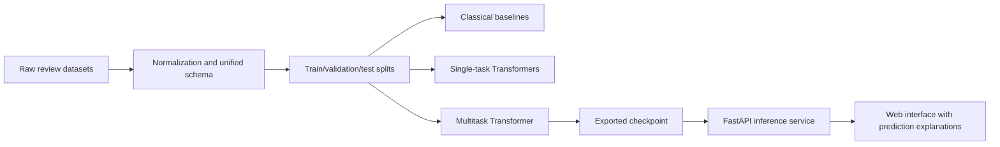

# Development of a Multitask Transformer-Based Model and Web System for Joint Sentiment Analysis and Review Authenticity Detection in E-Commerce

## Abstract

This paper addresses the joint analysis of review sentiment and review authenticity in e-commerce. The problem is important because online retail platforms depend not only on identifying whether customer feedback is positive or negative, but also on determining whether that feedback is trustworthy. A highly accurate sentiment model may still produce misleading business signals if a significant share of the input reviews is deceptive, manipulated, or generated automatically. In practice, sentiment analysis and review authenticity detection are often implemented as separate pipelines, which increases maintenance cost, duplicates infrastructure, and prevents potential knowledge transfer between the two tasks.

To address this limitation, the paper proposes a multitask Transformer-based approach with a shared encoder and two task-specific classification heads: one for sentiment classification and one for authenticity detection. The study is grounded in real and publicly available datasets of different types, including Russian e-commerce sentiment resources (`RuReviews`, `Perekrestok Reviews`), the classical `OpSpam` deceptive review benchmark, the `FraudDataset (Yelp)` benchmark for fraud-related authenticity signals, and `MAiDE-up` for AI-generated fake review detection. Because no single public dataset provides complete high-quality labels for both tasks at scale, the work introduces a unified partially labeled schema that supports heterogeneous datasets within one training pipeline.

Beyond the modeling component, the study develops a reproducible end-to-end system that covers data normalization, baseline training, single-task Transformer baselines, multitask training, model export, API-based inference, and a web interface for interactive review analysis. The implemented system returns not only task predictions and confidence scores but also a lightweight explanation layer based on ranked probabilities and transparent inference notes. The empirical study is designed to test whether the multitask model can remain competitive on sentiment classification while improving robustness and practical utility for authenticity detection compared with separate text-only baselines.

**Keywords:** sentiment analysis, review authenticity detection, fake review detection, multitask learning, Transformer, e-commerce, multilingual NLP, XLM-RoBERTa, web system.

## 1. Introduction

User reviews are one of the most influential information sources in digital commerce. They affect product ranking, merchant reputation, customer trust, and purchase decisions. For this reason, automatic review analysis has become a standard NLP application in e-commerce. Most existing systems focus on sentiment analysis, that is, identifying whether a review expresses a positive, neutral, or negative opinion.

However, real-world e-commerce review analysis cannot rely on sentiment alone. Platforms increasingly face deceptive, incentivized, spam-like, or automatically generated reviews. When such reviews are not filtered, the resulting sentiment signal may be technically correct for the text itself but analytically misleading for the underlying business reality. In other words, a system that detects polarity but ignores authenticity may still support the wrong decision-making process.

This observation suggests that review sentiment and review authenticity are related tasks rather than isolated ones. Both operate on the same text input, both depend on lexical, semantic, and stylistic signals, and both influence downstream trust and analytics. Despite this connection, most deployed systems still train separate models for sentiment analysis and authenticity detection. This separation is understandable from a practical standpoint, but it increases inference cost, duplicates system complexity, and does not exploit potential positive transfer between related tasks.

The goal of this study is therefore to develop a multitask Transformer-based model and a web system for joint sentiment analysis and review authenticity detection in e-commerce. The work combines a research contribution and an engineering contribution. On the research side, it evaluates whether a shared Transformer encoder with task-specific heads can improve or stabilize performance across both tasks. On the engineering side, it proposes a reproducible data-to-service pipeline that connects dataset normalization, model training, checkpoint export, API inference, and a browser-based user interface.

## 2. Related Work

The theoretical basis of this study lies in modern multitask learning for NLP. Recent surveys show that positive transfer depends on task relatedness, supervision density, and parameter-sharing strategy, with hard parameter sharing remaining one of the most practical designs for production-oriented systems [1]. In parallel, Transformer encoders such as BERT established a strong backbone for downstream text classification [2], while MT-DNN demonstrated that a shared encoder with task-specific heads can remain effective across multiple language-understanding tasks within one fine-tuning framework [3]. These findings provide a direct architectural rationale for a joint review-analysis model.

Within review authenticity detection, multitask and cross-domain learning are especially relevant because labeled deception data are fragmented across platforms, languages, and manipulation types. Hai et al. formulated deceptive review spam detection as a multi-task problem across domains and showed that exploiting task relatedness and unlabeled data improves generalization under limited labeled supervision [4]. Later resources such as DecOp expanded the discussion toward multilingual and multi-domain deception corpora, reinforcing the idea that authenticity detection should not be treated as a single closed-domain benchmark problem [5].

Subsequent studies made it clear that review authenticity is not reducible to surface-level fake-vs-real wording. Daryani and Caverlee investigated hijacked reviews, where text may be linguistically plausible but semantically mismatched to the product currently attached to it [6]. In an industrial e-commerce setting, Nayak and Garera showed that unified BERT-based moderation benefits from platform-specific label design and consolidated inference pipelines [7]. These findings motivate authenticity as a trust, moderation, and platform-integrity problem rather than only a standalone text-classification task.

The emergence of large language models introduced a new authenticity threat model: fluent AI-generated reviews. Liyanage et al. showed that LLM-generated hotel reviews form a distinct detection challenge rather than a trivial extension of earlier deceptive-review settings [8]. This line was strengthened by `MAiDE-up`, a multilingual benchmark that demonstrates how deception-detection difficulty varies across languages, locations, and sentiment strata [9]. Recent work around `DetectAIRev` further highlights weak cross-generator and cross-domain robustness as a central unresolved issue in authenticity detection [10].

On the sentiment side, e-commerce review analysis benefits from large realistic corpora rather than only narrow benchmark datasets. `Amazon Reviews 2023` provides one of the most comprehensive modern public resources for review text, metadata, and ratings at scale [11]. For Russian-language experimentation, `RuReviews` offers a product-review sentiment resource and `Perekrestok Reviews` provides a large in-domain retail corpus with review text and ratings [12, 13]. Multilingual resources such as `MARC` further show the importance of cross-lingual evaluation for review-focused sentiment modeling [14].

Explainability is also increasingly important in applied moderation systems. A binary authenticity output alone is rarely sufficient for analysts or trust-and-safety workflows. Recent work on explainable fake-review detection emphasizes that useful moderation systems should expose interpretable confidence patterns and transparent decision signals, even when they do not provide fully causal explanations [15].

Taken together, the literature reveals four key gaps. First, direct joint modeling of `sentiment + authenticity` for review-level e-commerce NLP remains limited. Second, authenticity is often treated as a simple binary variable even though practical review manipulation includes crowdsourced deception, platform-filter fraud, hijacked/context-mismatched reviews, and AI-generated text. Third, cross-domain and cross-generator robustness remains a major weakness of current authenticity models. Fourth, relatively few works combine a strong multitask model with a reproducible end-to-end applied system suitable for deployment.

## 3. Problem Definition and Research Hypotheses

Let a review text be denoted by `x`. The system must predict two related targets:

1. `y_s`, the sentiment class, where `y_s ∈ {negative, neutral, positive}`;
2. `y_a`, the authenticity class, where `y_a ∈ {authentic, fake}`.

An important challenge is that publicly available datasets rarely provide both labels for the same review at scale. As a result, the learning setup must support partially labeled records, where a review may be annotated for only one of the two tasks.

The main research hypothesis is that joint learning with a shared Transformer encoder will:

- preserve competitive performance for sentiment classification relative to a single-task Transformer baseline;
- improve or stabilize authenticity detection through richer shared language representations;
- produce a more compact and practically deployable inference system than two independent models.

The paper investigates the following specific hypotheses:

- `H1`: the multitask model does not underperform the single-task Transformer on sentiment analysis;
- `H2`: the multitask model outperforms text-only baselines for authenticity detection;
- `H3`: joint training improves robustness under mixed corpora and partial supervision.

The explanation-aware API is treated as an engineering feature rather than a standalone scientific hypothesis. Its role is to improve usability and traceability of predictions in the deployed system, while empirical claims about interpretability must be evaluated separately through calibration analysis or user studies.

## 4. Research Contribution and Novelty

The scientific contribution of the work can be summarized in four points.

1. It studies a unified review-level multitask setup for sentiment analysis and authenticity detection under partial supervision.
2. It proposes a unified data schema that allows heterogeneous public datasets to be combined within a single training and evaluation pipeline.
3. It evaluates authenticity across several threat models, including deceptive reviews, platform-level fraud signals, and AI-generated reviews.
4. It combines an algorithmic contribution with a systems contribution, moving from model design to a deployable API and web application.

From a positioning perspective, the article closes a gap between two research directions that are still often treated independently: review sentiment modeling and review authenticity detection. More precisely, the contribution is the combination of a shared-encoder multitask architecture, a partially labeled heterogeneous corpus design, and a deployable end-to-end workflow for trust-aware review analysis.

## 5. Data and Experimental Materials

To keep the study both realistic and reproducible, the experimental framework is built around real and publicly accessible datasets with different label semantics, languages, and domains.

| Dataset | Rows in current local preparation | Language | Domain | Task Signal | Label Provenance | Role in the Study |
|---|---:|---:|---|---|---|---|
| `RuReviews` | `60,602` | RU | e-commerce | 3-class sentiment | direct sentiment labels | primary Russian sentiment benchmark |
| `Perekrestok Reviews` | `642,682` | RU | grocery retail | rating-derived sentiment | heuristic mapping from ratings | large in-domain retail corpus |
| `FraudDataset (Yelp)` | not yet integrated locally | EN | local commerce | authenticity | platform-derived silver fraud labels | realism-oriented authenticity benchmark |
| `OpSpam` | not yet integrated locally | EN | hospitality | authenticity | gold deceptive-vs-truthful labels | legacy controlled text-only benchmark |
| `MAiDE-up` | `19,985` | multilingual | hospitality | authenticity | real-vs-AI-generated labels | modern synthetic-review threat model |
| `Amazon Reviews 2023` | optional | EN | e-commerce | sentiment / metadata | ratings + metadata | large-scale transfer extension |

This combination is necessary because no single public dataset currently offers both large-scale e-commerce sentiment labels and highly reliable authenticity annotations in one unified benchmark. Rather than hiding this limitation, the study explicitly embraces it by constructing a unified multitask corpus from several complementary resources. In the current implementation stage, real local preparation has already been completed for `RuReviews`, `Perekrestok Reviews`, and `MAiDE-up`, which makes it possible to report reproducible pilot experiments on public data rather than relying only on a design proposal.

## 6. Methodology

### 6.1. Multitask Model Architecture

The proposed model uses hard parameter sharing. A shared Transformer encoder, initialized with `XLM-RoBERTa`, produces a contextual representation for each review. This representation is passed to two independent classification heads:

- `Head_s` for sentiment classification;
- `Head_a` for authenticity detection.

Formally:

`h = Encoder(x)`

`p_s = softmax(W_s h + b_s)`

`p_a = softmax(W_a h + b_a)`

The training loss is defined as a weighted sum:

`L = λ_s * L_sentiment + λ_a * L_authenticity`

where each task-specific term is included only when the corresponding label exists. This makes the approach compatible with partial supervision.

### 6.2. Baselines

To evaluate the actual contribution of multitask learning, the following comparison lines are included:

1. `TF-IDF + Logistic Regression` for each task;
2. `Single-task Transformer` for sentiment classification;
3. `Single-task Transformer` for authenticity detection;
4. `Multitask Transformer` with a shared encoder.

This comparison separates the effect of Transformer-based modeling from the effect of joint learning.

### 6.3. Unified Data Schema

The project uses a unified record format:

- `text`
- `sentiment_label`
- `authenticity_label`
- `source`
- `language`
- `domain`
- `metadata`

This design makes heterogeneous datasets interoperable and supports reproducible experimentation across tasks and domains.

### 6.4. Training Protocol

To make the empirical comparison reproducible, the final experiment suite should fix three random seeds and report mean and standard deviation for the main metrics. Train, validation, and test splits must be source-aware and leakage-safe: duplicate or near-duplicate records should not cross split boundaries, and records from the same original source partition should remain grouped where dataset design requires it.

For partially labeled training, each minibatch should contribute only the loss terms supported by the available labels. Because dataset sizes differ substantially across sources, the study should compare at least two balancing strategies: naive concatenation and source-balanced sampling. Class imbalance for authenticity detection should be addressed through weighted loss, balanced sampling, or both, with the exact choice documented in the final experiment report.

In the current pilot configuration used by the repository, the compact multilingual backbone is `distilbert-base-multilingual-cased` with `max_length=128`, `batch_size=8`, `learning_rate=2e-5`, `weight_decay=0.01`, `epochs=1`, `dropout=0.1`, `random_state=42`, and CPU execution. The final dissertation experiments should extend this protocol with repeated runs, checkpoint-selection rules, and paired significance testing where applicable.

## 7. Web System Architecture

The proposed system is not only a research model but also a deployable application. The current `ReviewGuard` architecture includes:

1. raw-data normalization and merging utilities;
2. a training CLI for classical baselines, single-task Transformers, and multitask Transformers;
3. checkpoint export logic;
4. a `FastAPI` backend;
5. a lightweight browser-based interface.

The inference endpoint `/analyze` returns:

- predicted sentiment label;
- sentiment confidence score;
- predicted authenticity label;
- authenticity confidence score;
- explanation object.

The explanation layer is intentionally lightweight and practical. It exposes ranked task probabilities, token-count information, truncation status, and transparent notes about how to interpret the prediction. This makes the system more useful for moderation and analytical scenarios than a label-only API, but it should be interpreted as a transparency aid rather than a validated causal explanation mechanism.

## 8. Experimental Design

### 8.1. Experimental Scenarios

The full evaluation plan is:

1. `RuReviews` with a classical baseline for sentiment;
2. `OpSpam` with a classical baseline for authenticity;
3. single-task Transformer experiments for each task separately;
4. multitask training on a merged partially labeled corpus;
5. robustness evaluation on mixed authenticity benchmarks such as `FraudDataset` and `MAiDE-up`;
6. domain transfer analysis using `Perekrestok Reviews`.

### 8.2. Evaluation Metrics

The main metrics are:

- `Accuracy`
- `Macro-F1`
- `Weighted-F1`
- `Macro-Precision`
- `Macro-Recall`
- `Confusion Matrix`

For authenticity detection, `Macro-F1` is particularly important when class distributions are imbalanced.

### 8.3. Planned Analyses

In addition to aggregate metrics, the study should include:

- confusion-matrix analysis for both tasks;
- comparison tables across baseline, single-task, and multitask models;
- ablation on task-loss weights;
- error analysis for false positives and false negatives;
- robustness analysis across domains and dataset families.

### 8.4. Robustness and Validity Controls

Because the unified corpus combines different languages, domains, and labeling mechanisms, the evaluation protocol must explicitly test for shortcut learning. In addition to standard random splits within each source, the study should report:

- source-stratified evaluation;
- leave-one-dataset-out authenticity testing where feasible;
- language-aware sentiment evaluation;
- calibration analysis for confidence scores;
- qualitative inspection of failure modes that may reflect source or language artifacts rather than genuine authenticity cues.

## 9. Threats to Validity and Study Limitations

## 9. Preliminary Results on Real Public Data

The current repository stage already supports a reproducible pilot experiment on real data. A local pilot corpus was built from `1,000` sampled `RuReviews` records and `1,000` sampled `MAiDE-up` records using deterministic sampling with seed `42`. The resulting joint pilot set contains `2,000` reviews, all labeled for sentiment and `1,000` labeled for authenticity. The data were split into `80%/10%/10%` train/validation/test partitions through the project CLI.

As a first empirical reference point, a `TF-IDF + Logistic Regression` baseline was trained on the joint pilot corpus. Table 1 summarizes the held-out test metrics.

| Task | Accuracy | Macro-F1 | Weighted-F1 | Support |
|---|---:|---:|---:|---:|
| Sentiment | `0.8000` | `0.7368` | `0.8002` | `200` |
| Authenticity | `0.8000` | `0.7999` | `0.7999` | `100` |

The baseline establishes two useful observations. First, authenticity detection on the `MAiDE-up` pilot subset is non-trivial but already learnable from textual cues, reaching approximately `0.80` accuracy and macro-F1. Second, sentiment performance is materially affected by the severe rarity of the `neutral` class in the sampled test split, which depresses macro-F1 relative to weighted-F1 despite otherwise strong separation between positive and negative reviews. This confirms that macro-averaged reporting is necessary for a balanced interpretation of results.

These baseline results do not yet answer the central multitask hypothesis. However, they provide a concrete empirical anchor for the dissertation and validate that the current pipeline can ingest real public corpora, normalize them, build joint partially labeled samples, and train reproducible reference models. The next experimental step is the single-task and multitask Transformer comparison on the same pilot protocol.

## 10. Threats to Validity and Study Limitations

The study should explicitly acknowledge its limitations and avoid overclaiming beyond completed experiments.

First, public authenticity datasets differ substantially in label semantics. `OpSpam` reflects a controlled pre-LLM deceptive-writing setup, `FraudDataset` relies on silver fraud signals, and `MAiDE-up` targets AI-generated reviews. These are related but not identical manifestations of authenticity.

Second, Russian-language e-commerce resources are stronger on sentiment labeling than on authenticity labeling. This means that one branch of the multitask model may receive richer Russian supervision than the other.

Third, harmonizing all authenticity signals into a single binary `authentic/fake` target risks collapsing meaningfully different phenomena. Final experiments should therefore include dataset-specific reporting and discussion of whether binary harmonization is empirically justified.

Fourth, the current explanation layer is a probabilistic transparency mechanism, not a fully causal interpretability framework. It improves practical transparency but does not solve explanation in a strict interpretability-theoretic sense.

Fifth, the current article stage includes real-data baseline results, but the central transformer comparison is still incomplete. Any final claim about superiority must therefore be tied to completed single-task and multitask runs on the same protocol, not inferred from architecture alone.

## 11. Discussion

The most interesting scientific outcome of the study will not simply be the best F1 score on a single dataset, but the behavior of transfer across tasks and domains. If authenticity detection improves without degrading sentiment quality, the result will support multitask learning as a practical approach for trust-aware review analytics.

From a systems perspective, a shared encoder also reduces inference complexity relative to two separate Transformer services. For an e-commerce deployment, that matters: lower operational cost, a single export format, simpler maintenance, and a cleaner integration path into moderation or analytics workflows.

The growing importance of AI-generated reviews further strengthens the relevance of the work. By 2026, authenticity detection should not be framed only as a problem of human-written deception; it must also handle synthetic review generation and cross-generator generalization.

## 12. Conclusion

This paper proposes a multitask Transformer-based model and a web system for joint sentiment analysis and review authenticity detection in e-commerce. Instead of treating the two tasks as separate services, the system uses a shared encoder with task-specific heads and supports partially labeled heterogeneous corpora.

The contribution of the work is both scientific and practical. Scientifically, it connects sentiment analysis, deceptive review detection, AI-generated review detection, and multitask Transformer modeling within a single formulation. Practically, it implements a reproducible pipeline from dataset normalization to API deployment and browser-based inference.

The work now has a clear methodological scope, a defensible novelty claim, and a real-data baseline anchored in reproducible public corpora. The remaining requirement for a submission-ready article is the completion of the transformer comparison: final single-task and multitask tables, ablation studies, robustness analysis, and statistically grounded comparison against the established baseline.

## References

1. Zhang, Z., Yu, W., Yu, M., Guo, Z., Jiang, M. A Survey of Multi-task Learning in Natural Language Processing: Regarding Task Relatedness and Training Methods. *EACL*, 2023. [Link](https://aclanthology.org/2023.eacl-main.66/)
2. Devlin, J., Chang, M.-W., Lee, K., Toutanova, K. BERT: Pre-training of Deep Bidirectional Transformers for Language Understanding. *NAACL-HLT*, 2019. [Link](https://aclanthology.org/N19-1423/)
3. Liu, X., He, P., Chen, W., Gao, J. Multi-Task Deep Neural Networks for Natural Language Understanding. *ACL*, 2019. [Link](https://aclanthology.org/P19-1441/)
4. Hai, Z., Zhao, P., Cheng, P., Yang, P., Li, X.-L. Deceptive Review Spam Detection via Exploiting Task Relatedness and Unlabeled Data. *EMNLP*, 2016. [Link](https://aclanthology.org/D16-1187.pdf)
5. Capuozzo, P., Lauriola, I., Strapparava, C., Aiolli, F., Sartori, G. DecOp: A Multilingual and Multi-domain Corpus for Detecting Deception in Typed Text. *LREC*, 2020. [Link](https://aclanthology.org/2020.lrec-1.178/)
6. Daryani, S., Caverlee, J. Identifying Hijacked Reviews. *ECNLP*, 2021. [Link](https://aclanthology.org/2021.ecnlp-1.9/)
7. Nayak, A., Garera, N. Deploying Unified BERT Moderation Model for E-Commerce Reviews. *EMNLP Industry*, 2022. [Link](https://aclanthology.org/2022.emnlp-industry.55/)
8. Liyanage, A. et al. Detecting AI-enhanced Opinion Spambots: A Study on LLM-generated Hotel Reviews. *ECNLP*, 2024. [Link](https://aclanthology.org/2024.ecnlp-1.8/)
9. Ignat, O., Xu, X., Mihalcea, R. MAiDE-up: Multilingual Deception Detection of AI-generated Hotel Reviews. *Findings of NAACL*, 2025. [Link](https://aclanthology.org/2025.findings-naacl.88/)
10. Agrahari, S., Kumar, S., Sanasam, R. S. Can You Really Trust That Review? ProtoFewRoBERTa and DetectAIRev: A Prototypical Few-Shot Method and Multi-Domain Benchmark for Detecting AI-Generated Reviews. *Findings of IJCNLP-AACL*, 2025. [Link](https://aclanthology.org/2025.findings-ijcnlp.132/)
11. Hou, Y. et al. Amazon Reviews 2023. McAuley Lab, 2023. [Link](https://amazon-reviews-2023.github.io/main.html)
12. Sismetanin, A. RuReviews: An Automatically Annotated Sentiment Analysis Dataset of Product Reviews in Russian. GitHub repository, accessed 2026. [Link](https://github.com/sismetanin/rureviews)
13. Hugging Face. `lapki/perekrestok-reviews` dataset card, updated 2023. [Link](https://huggingface.co/datasets/lapki/perekrestok-reviews)
14. Keung, P., Lu, Y., Szarvas, G., Smith, N. A. The Multilingual Amazon Reviews Corpus. *EMNLP*, 2020. [Link](https://aclanthology.org/2020.emnlp-main.369/)
15. Shajalal, M., Atabuzzaman, M., Boden, A., Stevens, G., Du, D. What Matters in Explanations: Towards Explainable Fake Review Detection Focusing on Transformers. *arXiv*, 2024. [Link](https://arxiv.org/abs/2407.21056)

## System Diagram

