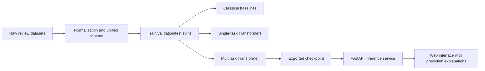

# Разработка мультитаск-трансформерной модели и веб-системы для совместного анализа тональности и достоверности отзывов в электронной коммерции

## Аннотация

В статье рассматривается задача совместного анализа тональности и достоверности пользовательских отзывов в электронной коммерции. Актуальность работы определяется тем, что современные e-commerce платформы зависят не только от общей эмоциональной оценки отзывов, но и от их подлинности: даже высокоточная sentiment-модель может давать искажённый аналитический сигнал, если значимая доля входных текстов является манипулятивной, заказной или автоматически сгенерированной. На практике sentiment analysis и review authenticity detection чаще всего реализуются как отдельные пайплайны, что увеличивает стоимость инференса, дублирует инфраструктуру и не позволяет использовать положительный перенос знаний между взаимосвязанными задачами.

Для устранения этого ограничения предлагается мультитаск-подход на основе общей трансформерной архитектуры кодировщика с двумя классификационными головами: для определения тональности отзыва и для определения его достоверности. В качестве экспериментальной базы используются реальные и общедоступные датасеты разных типов: русскоязычные e-commerce отзывы (`RuReviews`, `Perekrestok Reviews`), классический корпус обманных отзывов `OpSpam`, benchmark `FraudDataset (Yelp)` и современный мультиязычный набор `MAiDE-up` для анализа AI-generated fake reviews. Поскольку в публичном поле отсутствует единый крупный датасет, одновременно покрывающий обе задачи с надёжной разметкой, в работе вводится унифицированная схема частично размеченных данных, позволяющая объединять разнородные корпуса в единый обучающий контур.

Помимо модельной части, работа включает воспроизводимую прикладную систему `ReviewGuard`, охватывающую нормализацию данных, обучение базовых моделей, single-task и multitask Transformer, экспорт модели, API-инференс и веб-интерфейс для интерактивного анализа отзывов. Реализованный сервис спроектирован так, чтобы возвращать не только предсказания и confidence scores, но и прозрачный слой объяснения на основе ранжированных вероятностей, признака усечения текста и интерпретационных заметок. На текущем этапе pilot-эксперимент на реальных публичных данных подтверждает работоспособность контура и задаёт эмпирическую точку отсчёта для дальнейшего сравнения `baseline -> single-task -> multitask`, однако итоговые трансформерные сравнения ещё требуют завершения.

**Ключевые слова:** анализ тональности, достоверность отзывов, fake review detection, multitask learning, Transformer, e-commerce, XLM-RoBERTa, веб-система.

## 1. Введение

Отзывы пользователей являются одним из ключевых источников информации в цифровой торговле. Они влияют на ранжирование товаров, доверие покупателей, репутацию продавца и итоговые бизнес-решения. По этой причине автоматический анализ отзывов давно стал стандартной задачей прикладной обработки естественного языка. Наиболее распространённым направлением в этой области остаётся sentiment analysis, то есть определение эмоциональной полярности текста как положительной, нейтральной или отрицательной.

Однако для реальных e-commerce систем анализа одной только тональности недостаточно. Платформы всё чаще сталкиваются с заказными, манипулятивными, спамными и автоматически сгенерированными отзывами. Если такие тексты не фильтруются, модель может корректно определять тональность самого текста, но при этом давать аналитически ложный сигнал о реальном пользовательском опыте. Следовательно, задача определения тональности и задача проверки достоверности отзыва связаны между собой не только прикладным контекстом, но и общим языковым представлением текста.

Несмотря на это, в большинстве практических систем sentiment analysis и authenticity detection строятся как независимые пайплайны. Такой подход инженерно прост, но приводит к дублированию инфраструктуры, увеличению стоимости инференса и потере потенциального положительного transfer effect между связанными задачами. С научной точки зрения это также затрудняет проверку гипотезы о том, может ли совместное обучение улучшить качество одной или обеих задач.

Целью настоящей работы является разработка мультитаск-трансформерной модели и веб-системы для совместной классификации тональности и достоверности отзывов в электронной коммерции. Работа сочетает исследовательский и инженерный вклад. С одной стороны, предлагается и обосновывается архитектура совместного обучения; с другой стороны, строится воспроизводимый контур `data -> training -> export -> API -> web UI`, пригодный для практического применения после завершения полного цикла обучения и валидации моделей.

## 2. Обзор литературы

Теоретической основой исследования является multitask learning. В классической работе Caruana было показано, что совместное обучение связанных задач способно улучшать обобщающую способность модели за счёт общего индуктивного смещения [1]. Для современных NLP-постановок это направление получило новое развитие с распространением pre-trained Transformers. В частности, BERT стал базовой архитектурой кодировщика для широкого круга задач классификации текста [2], а MT-DNN продемонстрировал практическую состоятельность схемы `shared encoder + task-specific heads` в multi-task fine-tuning [3]. Современные обзоры MTL в NLP подчёркивают, что положительный перенос определяется близостью задач, качеством сигналов обучения и способом разделения параметров [4].

Для review authenticity detection фундаментальным остаётся корпус Ott et al., в котором была формализована задача deceptive opinion spam detection и предложен benchmark для truthful/deceptive classification [5]. Дальнейшие исследования показали, что authenticity нельзя сводить к одному замкнутому сценарию. Так, Hai et al. предложили рассматривать deceptive review detection как multi-task problem across domains и использовать relatedness between tasks вместе с unlabeled data [6]. Это особенно важно для настоящей работы, поскольку её постановка также опирается на разнородные корпуса и частичную разметку.

Следующий шаг в развитии authenticity research связан с осознанием того, что поддельность отзыва не исчерпывается поверхностной лингвистикой. Daryani и Caverlee описали задачу hijacked reviews, когда текст выглядит правдоподобным, но семантически не соответствует текущему товарному контексту [7]. В промышленной плоскости Nayak и Garera показали, что unified BERT-based moderation model для e-commerce выигрывает от единого инференсного контура и platform-aware design [8]. Эти работы важны для позиционирования настоящего исследования как задачи trust-aware review analysis, а не только узкой бинарной классификации текста.

Отдельное направление последних лет связано с AI-generated reviews. В 2024 году было показано, что LLM-generated hotel reviews формируют самостоятельную detection-задачу, а не тривиальное продолжение классического deceptive spam setting [9]. В 2025 году корпус `MAiDE-up` зафиксировал актуальность multilingual evaluation для detection AI-generated hotel reviews [10]. Дополнительный вклад внесли работы, связанные с `DetectAIRev`, подчеркнувшие проблему слабой cross-generator robustness и доменной чувствительности современных review detectors [11].

Для sentiment analysis в e-commerce ключевую роль играют реальные крупные корпуса. Масштабным источником является `Amazon Reviews 2023` [12]. В русскоязычном сегменте практический интерес представляют `RuReviews` как benchmark продуктовых отзывов [13] и `Perekrestok Reviews` как большой in-domain retail corpus [14]. В мультиязычном контексте значим и `MARC`, демонстрирующий важность multilingual sentiment evaluation на продуктовых отзывах [15].

Наконец, растёт значение explainability. Для applied moderation systems недостаточно только бинарной метки: аналитикам и исследователям важны confidence patterns, ranked probabilities и прозрачные сигналы о ненадёжности решения. Современные работы по explainable fake review detection подчеркивают, что даже облегчённый слой прозрачности имеет практическую ценность, если не выдаётся за causal interpretability [16].

Таким образом, литература выявляет четыре ключевых пробела. Во-первых, прямых работ уровня `joint sentiment + authenticity` для review-level e-commerce задач по-прежнему немного. Во-вторых, authenticity часто редуцируется к одному бинарному сценарию, хотя в реальности включает crowdsourced deception, platform-driven fraud signals, hijacked/context-mismatched reviews и AI-generated texts. В-третьих, cross-domain и cross-generator robustness остаётся слабым местом современных систем. В-четвёртых, сравнительно редко встречаются работы, одновременно предлагающие сильную мультитаск-модель, унифицированный partially labeled data pipeline и готовую прикладную веб-систему.

## 3. Постановка задачи и гипотезы исследования

Пусть задан текст отзыва `x`. Необходимо предсказать два связанных целевых признака:

1. `y_s` — класс тональности, где `y_s ∈ {negative, neutral, positive}`;
2. `y_a` — класс достоверности, где `y_a ∈ {authentic, fake}`.

Существенная сложность состоит в том, что доступные публичные корпуса редко содержат оба типа меток для одного и того же текста. Следовательно, модель должна поддерживать частично размеченные записи, где для отзыва известна только тональность или только authenticity label.

Основная исследовательская гипотеза состоит в том, что совместное обучение на общей трансформерной части кодировщика:

- не ухудшит качество sentiment classification по сравнению с single-task Transformer baseline;
- улучшит или стабилизирует authenticity detection за счёт более богатого общего языкового представления;
- позволит построить более компактную и practically deployable систему, чем два независимых inference-сервиса.

В работе проверяются следующие частные гипотезы:

- `H1`: мультитаск-модель не уступает single-task Transformer по качеству sentiment analysis;
- `H2`: мультитаск-модель превосходит text-only baselines по authenticity detection;
- `H3`: совместное обучение повышает устойчивость в сценариях mixed corpora и partial supervision.

Explainability-oriented API рассматривается как инженерная особенность системы, а не как отдельная научная гипотеза: он повышает практическую прозрачность, но не должен интерпретироваться как завершённое решение задачи объяснимости.

## 4. Научная новизна и вклад работы

Научный и практический вклад исследования можно сформулировать в четырёх пунктах.

1. Предлагается единая мультитаск-постановка для совместного анализа тональности и достоверности отзывов в e-commerce при partial supervision.
2. Вводится унифицированная схема данных, позволяющая объединять разнородные публичные датасеты в одном обучающем и оценочном контуре.
3. В authenticity-блок включаются несколько современных threat models: deceptive reviews, silver fraud labels и AI-generated fake reviews.
4. Модельный вклад соединяется с системным: от нормализации и обучения до API и web UI.

С точки зрения позиционирования в литературе работа направлена на закрытие разрыва между двумя традиционно раздельными направлениями: `review sentiment modeling` и `review authenticity detection`. В более сжатой публикационной формуле вклад можно описать как shared-encoder multitask architecture + partially labeled heterogeneous corpus design + deployable end-to-end workflow for trust-aware review analysis.

## 5. Материалы и данные

Экспериментальная схема строится на реальных и общедоступных корпусах, отличающихся по языку, домену и природе разметки. Ниже жёстко разделяются три статуса: корпуса, уже подготовленные локально; корпуса, использованные в pilot-экспериментах; корпуса, запланированные для полной финальной серии опытов.

| Датасет | Число записей в текущей локальной подготовке | Язык | Домен | Сигнал задачи | Происхождение меток | Роль в работе |
|---|---:|---:|---|---|---|---|
| `RuReviews` | `60 602` | RU | e-commerce | 3-class sentiment | готовые sentiment labels | основной русскоязычный benchmark |
| `Perekrestok Reviews` | `642 682` | RU | retail | rating-derived sentiment | эвристическое отображение рейтинга | крупный in-domain corpus |
| `FraudDataset (Yelp)` | локально пока не интегрирован | EN | local commerce | authenticity | silver fraud labels | realism-oriented benchmark |
| `OpSpam` | локально пока не интегрирован | EN | hospitality | authenticity | truthful/deceptive labels | классический text-only benchmark |
| `MAiDE-up` | `19 985` | multilingual | hospitality | authenticity | real vs AI-generated | современный benchmark для synthetic reviews |
| `Amazon Reviews 2023` | опционально | EN | e-commerce | sentiment / metadata | ratings + metadata | масштабный auxiliary corpus |

Такой набор выбран осознанно: в публичном поле пока отсутствует единый крупный корпус, одновременно покрывающий и sentiment, и authenticity с высокой надёжностью разметки. Поэтому в работе научно корректнее явно строить unified multitask corpus из нескольких комплементарных источников, чем имитировать наличие идеального набора данных.

В текущей версии репозитория фактически подготовлены локально `RuReviews`, `Perekrestok Reviews` и `MAiDE-up`, а pilot-результаты в настоящей статье опираются только на sampled subsets из `RuReviews` и `MAiDE-up`. Корпуса `OpSpam` и `FraudDataset (Yelp)` включены в дизайн финальной экспериментальной серии, но не должны описываться как уже использованные в полученных результатах.

## 6. Метод

### 6.1. Архитектура мультитаск-модели

Предлагаемая модель использует hard parameter sharing. Базовый кодировщик инициализируется на основе `XLM-RoBERTa`, что позволяет работать как с русскоязычными, так и с англоязычными отзывами в одном пространстве представлений. После его работы применяется pooling, а затем два независимых classification heads:

- `Head_s` для sentiment classification;
- `Head_a` для authenticity detection.

Формально:

`h = Encoder(x)`

`p_s = softmax(W_s h + b_s)`

`p_a = softmax(W_a h + b_a)`

Функция потерь строится как взвешенная сумма:

`L = λ_s * L_sentiment + λ_a * L_authenticity`

При отсутствии метки по одной из задач соответствующий компонент loss исключается из вычисления, что делает модель пригодной для partial supervision.

### 6.2. Базовые модели для сравнения

Для оценки полезности мультитаск-обучения используются следующие comparison lines:

1. `TF-IDF + Logistic Regression` для каждой задачи;
2. `Single-task Transformer` для sentiment classification;
3. `Single-task Transformer` для authenticity detection;
4. `Multitask Transformer` с общей encoder-частью.

Такой набор позволяет отделить эффект трансформеров как класса моделей от эффекта именно совместного обучения.

### 6.3. Унифицированная схема данных

В проекте используется единый формат записи:

- `text`
- `sentiment_label`
- `authenticity_label`
- `source`
- `language`
- `domain`
- `metadata`

Эта схема позволяет агрегировать разные корпуса и обеспечивает воспроизводимость экспериментов на уровне входных данных.

### 6.4. Протокол обучения

Для финальной диссертационной версии экспериментов необходимо зафиксировать не менее трёх random seeds и для основных метрик приводить mean ± std. Train/validation/test splits должны быть leakage-safe: дубликаты и near-duplicates не должны попадать в разные части разбиения, а исходные source partitions следует сохранять там, где это предусмотрено самим датасетом.

Для обучения на частично размеченных данных каждый minibatch должен вносить в loss только те компоненты, по которым реально есть метки. Поскольку размеры источников сильно отличаются, следует сравнить как минимум две стратегии балансировки: naive concatenation и source-balanced sampling. Дисбаланс authenticity-классов должен компенсироваться через weighted loss, balanced sampling или их комбинацию с явным описанием выбранного варианта в итоговом train report.

В текущем pilot-протоколе репозитория использовалась компактная multilingual backbone `distilbert-base-multilingual-cased` с параметрами `max_length=128`, `batch_size=8`, `learning_rate=2e-5`, `weight_decay=0.01`, `epochs=1`, `dropout=0.1`, `random_state=42` и CPU execution. Финальные диссертационные эксперименты должны расширить этот протокол repeated runs, правилами выбора checkpoint и статистически корректным сравнением моделей.

## 7. Архитектура веб-системы

Система `ReviewGuard` ориентирована не только на исследовательский, но и на прикладной результат. Текущая архитектура включает:

1. модуль нормализации и объединения данных;
2. training CLI для classical baselines, single-task Transformers и multitask Transformers;
3. слой экспорта модели;
4. `FastAPI` backend;
5. lightweight browser-based interface.

Endpoint `/analyze` возвращает:

- предсказанную метку тональности;
- confidence score для тональности;
- предсказанную метку достоверности;
- confidence score для достоверности;
- explanation object.

Слой объяснения intentionally остаётся lightweight и practical. Он содержит ranked task probabilities, token-count information, truncation status и прозрачные интерпретационные заметки. Такой слой полезен для moderation и аналитических сценариев, но в тексте статьи должен трактоваться как transparency aid, а не как fully causal explanation framework.

## 8. Дизайн экспериментов

### 8.1. Экспериментальные сценарии

Полный план оценки включает:

1. `RuReviews` с classical baseline для sentiment;
2. `OpSpam` с classical baseline для authenticity;
3. single-task Transformer experiments для каждой задачи по отдельности;
4. multitask training на merged partially labeled corpus;
5. robustness evaluation на смешанных authenticity benchmarks, включая `FraudDataset` и `MAiDE-up`;
6. domain transfer analysis с использованием `Perekrestok Reviews`.

### 8.2. Метрики

Основными метриками являются:

- `Accuracy`
- `Macro-F1`
- `Weighted-F1`
- `Macro-Precision`
- `Macro-Recall`
- `Confusion Matrix`

Для authenticity detection основной интерпретационный акцент следует делать на `Macro-F1`, особенно при дисбалансе классов.

### 8.3. Планируемые аналитические срезы

Помимо агрегированных метрик, в финальной версии необходимо включить:

- confusion-matrix analysis по обеим задачам;
- comparison tables `baseline / single-task / multitask`;
- ablation по task-loss weights;
- error analysis для false positives и false negatives;
- robustness analysis across domains and dataset families.

### 8.4. Контроль устойчивости и валидности

Поскольку unified corpus объединяет разные языки, домены и механизмы разметки, протокол оценки должен явно проверять отсутствие shortcut learning. Желательно дополнительно отчитаться по следующим сценариям:

- source-stratified evaluation;
- leave-one-dataset-out authenticity testing, где это возможно;
- language-aware sentiment evaluation;
- calibration analysis для confidence scores;
- qualitative inspection failure cases, указывающих на source or language artifacts.

### 8.5. Сравнение с ближайшими работами

Для более строгого позиционирования статья должна сравниваться с ближайшими направлениями не только описательно, но и структурно.

| Направление | Тип данных | Совместное обучение задач | Partial supervision | Cross-domain анализ | Прикладной системный контур |
|---|---|---|---|---|---|
| Классические работы по deceptive review detection | обычно один домен | как правило, нет | редко | ограничен | обычно нет |
| Review sentiment benchmarks | e-commerce отзывы | нет | не требуется | ограничен | обычно нет |
| Работы по AI-generated review detection | synthetic / hospitality | редко | редко | частично | обычно нет |
| Настоящая работа | heterogeneous public corpora | да | да | запланирован как обязательный блок | да |

Именно сочетание joint learning, heterogeneous partially labeled corpora и web-oriented deployment pipeline является заявленным исследовательско-инженерным отличием настоящей работы. Однако в финальной версии статьи этот тезис должен подтверждаться не только архитектурой, но и завершёнными экспериментальными сравнениями.

## 9. Предварительные результаты на реальных публичных данных

Текущий репозиторий уже поддерживает воспроизводимый pilot-эксперимент на реальных данных. Локальный pilot corpus был собран из `1 000` семплированных записей `RuReviews` и `1 000` семплированных записей `MAiDE-up` с детерминированным seed `42`. Итоговый joint pilot set содержит `2 000` отзывов, из которых все размечены по sentiment и `1 000` размечены по authenticity. Разбиение на train/validation/test осуществлялось через project CLI по схеме `80/10/10`.

В качестве первой эмпирической точки отсчёта была обучена baseline-модель `TF-IDF + Logistic Regression`. Таблица 1 содержит метрики на test split.

| Задача | Accuracy | Macro-F1 | Weighted-F1 | Support |
|---|---:|---:|---:|---:|
| Sentiment | `0.8000` | `0.7368` | `0.8002` | `200` |
| Authenticity | `0.8000` | `0.7999` | `0.7999` | `100` |

Для корректной интерпретации этих чисел pilot baseline должен рассматриваться только как нижняя эмпирическая точка отсчёта. Без majority baseline, class distribution table, confusion matrices и повторных прогонов по нескольким seeds данные значения не могут служить основанием для сильных выводов о преимуществах архитектуры. Тем не менее уже сейчас они показывают, что pipeline способен обрабатывать реальные публичные данные, формировать joint pilot corpus и выдавать воспроизводимые reference metrics.

Эти baseline-результаты пока не закрывают центральную гипотезу о преимуществах мультитаск-обучения. Они лишь дают необходимую эмпирическую опору: pipeline уже способен ingest real public corpora, нормализовать их, собирать joint partially labeled samples и обучать воспроизводимые reference models. Следующий обязательный шаг — single-task и multitask Transformer comparison на том же pilot protocol, а затем на полном наборе данных.

## 10. Ограничения и угрозы валидности

Работа должна явно фиксировать ограничения и не делать выводов за пределами завершённых экспериментов.

Во-первых, публичные authenticity datasets существенно различаются по семантике меток. `OpSpam` отражает controlled deceptive-writing setting, `FraudDataset` опирается на silver fraud signals, а `MAiDE-up` целенаправленно моделирует AI-generated reviews. Это связанные, но не идентичные формы недостоверности.

Во-вторых, русскоязычные e-commerce ресурсы значительно лучше покрывают sentiment, чем authenticity. Поэтому одна ветвь мультитаск-модели может получать гораздо более богатый supervision signal на русском языке, чем другая.

В-третьих, сведение всех authenticity signals к единой бинарной шкале `authentic/fake` неизбежно упрощает различающиеся феномены. Поэтому финальная статья должна содержать dataset-specific reporting и обсуждение того, насколько такая бинарная гармонизация эмпирически оправдана.

В-четвёртых, текущий explanation layer является probabilistic transparency mechanism, а не полноценной causal interpretability system. Он повышает практическую прозрачность, но не снимает проблему объяснимости в строгом теоретическом смысле.

В-пятых, на текущем этапе в репозитории уже есть real-data baseline results, но центральное transformer-сравнение ещё не завершено. Следовательно, любые сильные утверждения о превосходстве архитектуры должны опираться только на завершённые прогоны `single-task` и `multitask`, а не на архитектурные ожидания.

## 11. Обсуждение

С научной точки зрения наиболее интересным исходом будет не просто максимум F1 на одном датасете, а анализ transfer dynamics between tasks and domains. Если совместное обучение действительно помогает authenticity detection without harming sentiment quality, это станет сильным аргументом в пользу мультитаск-архитектур для trust-aware review analytics.

С инженерной точки зрения важен и другой результат: единый encoder уменьшает сложность инференса по сравнению с двумя независимыми Transformer-сервисами. Для e-commerce платформы это означает меньшую операционную стоимость, единый export format, более простое сопровождение и более чистую интеграцию в moderation или analytics workflow.

Особую актуальность работе придаёт growing importance of AI-generated reviews. К 2026 году authenticity detection уже нельзя рассматривать только как задачу выявления человеческого deceptive spam; она должна учитывать и synthetic review generation, и cross-generator generalization.

## 12. Заключение

В статье предложена мультитаск-трансформерная модель и веб-система для совместного анализа тональности и достоверности отзывов в электронной коммерции. В отличие от традиционного раздельного подхода, система использует shared encoder with task-specific heads и поддерживает partially labeled heterogeneous corpora.

Научная ценность работы состоит в объединении sentiment analysis, deceptive review detection, AI-generated review detection и multitask Transformer modeling в одной формальной постановке. Практическая ценность выражается в реализации воспроизводимого pipeline от нормализации данных до API deployment и browser-based inference.

На текущем этапе работа уже имеет чёткую методологическую рамку, защищаемую постановку задачи и real-data baseline, подтверждающий жизнеспособность исследовательского контура. Однако статья ещё не должна рассматриваться как полностью завершённый научный результат: для submission-ready версии необходимо завершить transformer comparison, получить итоговые таблицы для `single-task` и `multitask`, провести ablation, robustness analysis и статистически корректное сравнение с baseline.

## Схема системы

## Список литературы

1. Caruana R. Multitask Learning. *Machine Learning*, 1997. URL: <https://link.springer.com/article/10.1023/A:1007379606734>
2. Devlin J., Chang M.-W., Lee K., Toutanova K. BERT: Pre-training of Deep Bidirectional Transformers for Language Understanding. *NAACL-HLT*, 2019. URL: <https://aclanthology.org/N19-1423/>
3. Liu X., He P., Chen W., Gao J. Multi-Task Deep Neural Networks for Natural Language Understanding. *ACL*, 2019. URL: <https://aclanthology.org/P19-1441/>
4. Zhang Z., Yu W., Yu M., Guo Z., Jiang M. A Survey of Multi-task Learning in Natural Language Processing: Regarding Task Relatedness and Training Methods. *EACL*, 2023. URL: <https://aclanthology.org/2023.eacl-main.66/>
5. Ott M., Choi Y., Cardie C., Hancock J. T. Finding Deceptive Opinion Spam by Any Stretch of the Imagination. *ACL*, 2011. URL: <https://aclanthology.org/P11-1032/>
6. Hai Z., Zhao P., Cheng P., Yang P., Li X.-L. Deceptive Review Spam Detection via Exploiting Task Relatedness and Unlabeled Data. *EMNLP*, 2016. URL: <https://aclanthology.org/D16-1187/>
7. Daryani S., Caverlee J. Identifying Hijacked Reviews. *ECNLP*, 2021. URL: <https://aclanthology.org/2021.ecnlp-1.9/>
8. Nayak A., Garera N. Deploying Unified BERT Moderation Model for E-Commerce Reviews. *EMNLP Industry*, 2022. URL: <https://aclanthology.org/2022.emnlp-industry.55/>
9. Liyanage A. et al. Detecting AI-enhanced Opinion Spambots: A Study on LLM-generated Hotel Reviews. *ECNLP*, 2024. URL: <https://aclanthology.org/2024.ecnlp-1.8/>
10. Ignat O., Xu X., Mihalcea R. MAiDE-up: Multilingual Deception Detection of AI-generated Hotel Reviews. *Findings of NAACL*, 2025. URL: <https://aclanthology.org/2025.findings-naacl.88/>
11. Agrahari S., Kumar S., Sanasam R. S. Can You Really Trust That Review? ProtoFewRoBERTa and DetectAIRev: A Prototypical Few-Shot Method and Multi-Domain Benchmark for Detecting AI-Generated Reviews. *Findings of IJCNLP-AACL*, 2025. URL: <https://aclanthology.org/2025.findings-ijcnlp.132/>
12. Hou Y. et al. Amazon Reviews 2023. McAuley Lab, 2023. URL: <https://amazon-reviews-2023.github.io/main.html>
13. Sismetanin A. RuReviews: An Automatically Annotated Sentiment Analysis Dataset of Product Reviews in Russian. URL: <https://github.com/sismetanin/rureviews>
14. Hugging Face. `lapki/perekrestok-reviews` dataset card. URL: <https://huggingface.co/datasets/lapki/perekrestok-reviews>
15. Keung P. et al. The Multilingual Amazon Reviews Corpus. *EMNLP*, 2020. URL: <https://aclanthology.org/2020.emnlp-main.369/>
16. Shajalal M., Atabuzzaman M., Boden A., Stevens G., Du D. What Matters in Explanations: Towards Explainable Fake Review Detection Focusing on Transformers. *arXiv*, 2024. URL: <https://arxiv.org/abs/2407.21056>
