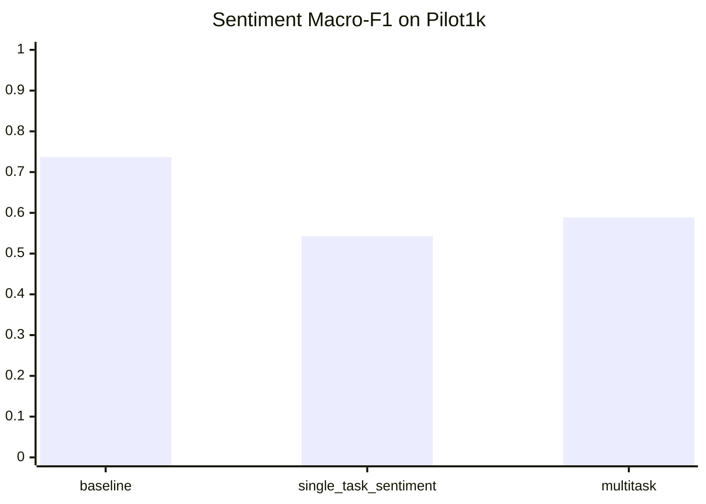
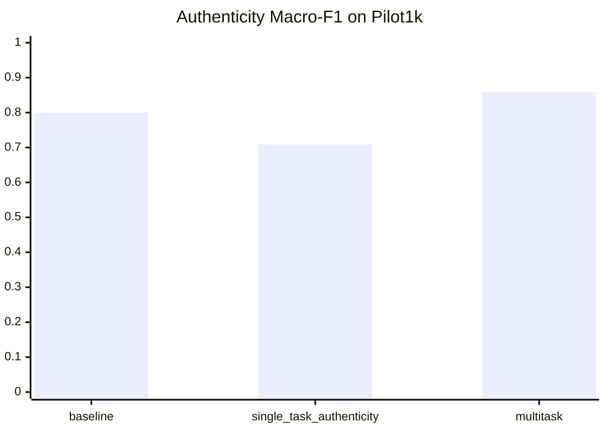

# Pilot1k Results Analysis

## Scope

This report re-evaluates the exported study artifacts on the deterministic `joint_reviews.pilot1k` split and summarizes the observed strengths, weaknesses, and error patterns. It should be read as a low-resource study memo, not as a benchmark-level final result.

## Split summary

- train: `1600`
- valid: `200`
- test: `200`
- sentiment test support: `200`
- authenticity test support: `100`

## Immediate caution

- The sentiment test split contains only `5` `neutral` examples.
- That makes sentiment Macro-F1 highly unstable and sensitive to one or two mistakes.
- Any reviewer-facing claim about sentiment quality on this study protocol must therefore be explicitly qualified as low-support evidence.

## Comparative metrics

| Model | Task | Accuracy | Macro-F1 | Weighted-F1 | Macro-Precision | Macro-Recall | Support |
|---|---|---:|---:|---:|---:|---:|---:|
| `baseline` | `sentiment` | `0.8000` | `0.7368` | `0.8002` | `0.7385` | `0.7370` | `200` |
| `single_task_sentiment` | `sentiment` | `0.8050` | `0.5428` | `0.7941` | `0.5427` | `0.5497` | `200` |
| `multitask` | `sentiment` | `0.7000` | `0.5885` | `0.6932` | `0.6051` | `0.6035` | `200` |
| `baseline` | `authenticity` | `0.8000` | `0.7999` | `0.7999` | `0.8005` | `0.8000` | `100` |
| `single_task_authenticity` | `authenticity` | `0.7300` | `0.7088` | `0.7088` | `0.8247` | `0.7300` | `100` |
| `multitask` | `authenticity` | `0.8600` | `0.8580` | `0.8580` | `0.8820` | `0.8600` | `100` |

## Main findings

- The `multitask` model is the strongest authenticity detector in the current study, reaching `0.8600` accuracy and `0.8580` macro-F1.
- The `baseline` remains the most stable sentiment model, with `0.7368` macro-F1 versus `0.5885` for the multitask model.
- The `single-task sentiment` Transformer slightly improves raw accuracy over the baseline, but its macro-F1 collapses because the rare `neutral` class is not handled well.
- The `single-task authenticity` Transformer overpredicts the `fake` class and performs worse than both the baseline and the multitask model.

## Statistical reading of the result package

- `Authenticity` is the only result that currently deserves a strong positive statement. Across `3` train seeds, multitask authenticity reaches `0.9160 +/- 0.0524` macro-F1 and beats the single-task authenticity Transformer by `+0.0832` with a positive paired 95% bootstrap interval (`[0.0447, 0.1274]`) and `p=0.0005`.
- `Sentiment` does not show a real multitask gain. The multitask-vs-single-task delta is only `+0.0042`, the interval crosses zero widely (`[-0.0915, 0.0954]`), and `p=0.9510`.
- `Sentiment` multitask-vs-baseline is not merely inconclusive; it is negative on the current study (`-0.1513` macro-F1, `p=0.0025`).
- Practical evidence grading for the manuscript: treat the authenticity effect as `solid within-study evidence`, and treat all sentiment ranking statements as `caution-level evidence`.
- The current pairwise tests are appropriate as planned study contrasts, but they should not be described as a fully confirmatory statistical package because there are only `3` train seeds and no formal multiplicity-control layer.

## What the pilot does support

- A real end-to-end pipeline exists and works on public data.
- The multitask setup is not merely conceptual; it produces a measurable authenticity gain on the current held-out pilot split.
- Transfer is asymmetric rather than uniformly positive.

## What the pilot does not support

- It does not support a general claim that multitask learning is better for both tasks.
- It does not support a benchmark-scale claim about robustness across domains or languages.
- It does not support a stable sentiment ranking because the minority `neutral` class is too sparse.
- It does not justify treating pooled authenticity as if all authenticity benchmarks had identical label semantics.

## Confusion matrices

### `baseline` - `sentiment`

| true ↓ / pred → | `negative` | `neutral` | `positive` |
|---|---|---|---|
| `negative` | 77 | 0 | 22 |
| `neutral` | 0 | 3 | 2 |
| `positive` | 14 | 2 | 80 |

### `single_task_sentiment` - `sentiment`

| true ↓ / pred → | `negative` | `neutral` | `positive` |
|---|---|---|---|
| `negative` | 89 | 0 | 10 |
| `neutral` | 4 | 0 | 1 |
| `positive` | 24 | 0 | 72 |

### `multitask` - `sentiment`

| true ↓ / pred → | `negative` | `neutral` | `positive` |
|---|---|---|---|
| `negative` | 86 | 3 | 10 |
| `neutral` | 2 | 2 | 1 |
| `positive` | 43 | 1 | 52 |

### `baseline` - `authenticity`

| true ↓ / pred → | `authentic` | `fake` |
|---|---|---|
| `authentic` | 41 | 9 |
| `fake` | 11 | 39 |

### `single_task_authenticity` - `authenticity`

| true ↓ / pred → | `authentic` | `fake` |
|---|---|---|
| `authentic` | 23 | 27 |
| `fake` | 0 | 50 |

### `multitask` - `authenticity`

| true ↓ / pred → | `authentic` | `fake` |
|---|---|---|
| `authentic` | 37 | 13 |
| `fake` | 1 | 49 |

## Class-wise observations

- In sentiment, the `neutral` class is the key bottleneck: the baseline gets `3/5` neutral examples correct, the multitask model `2/5`, and the single-task sentiment model `0/5`.
- The largest sentiment degradation in the multitask model is `positive -> negative`: `43` such errors versus `14` for the baseline.
- In authenticity, the single-task model reaches perfect fake-review recall (`50/50`) but misclassifies `27` authentic reviews as fake.
- The multitask model preserves near-perfect fake recall (`49/50`) while reducing authentic-review false alarms relative to the single-task authenticity model.

## Study interpretation against H1--H3

- `H1` is not supported on the current study protocol. Multitask sentiment is statistically tied with the single-task Transformer and clearly below the classical baseline.
- `H2` is supported only within the current study scope. Multitask training improves authenticity detection on this fixed split relative to the tested comparison models.
- `H3` is still unresolved at the benchmark level. The study shows that transfer can help one task without helping the other, but it does not yet provide the source/domain/language-sliced robustness evidence needed for a stronger claim.

## Representative error examples

### Single-task sentiment misses on `neutral` reviews

1. `понравилось,по ощущениям хлопка нет, сшито плохо и не аккуратно , максимум прослужит пару месяцев. Пришло за 3 недели.Продавца рекомендую." neautral заказала согласно размерной...`
   source: `rureviews`
   language: `ru`
   truth: `neutral`
   single_pred: `negative`

2. `а вот общением с продавцом не довольна: через неделю после оформления заказа,он мне сообщил,что выбранной расцветки моего размера нет.ок. выбрала другу. через неделю пришло...`
   source: `rureviews`
   language: `ru`
   truth: `neutral`
   single_pred: `negative`

3. `какую то хрень, в итоге размер мал. Доставка быстрая."`
   source: `rureviews`
   language: `ru`
   truth: `neutral`
   single_pred: `positive`

4. `Покупала 3 пары леггинсов, отдала одни сестре (она очень худенькая девочка От 55, Об 77) они с неё сползали всю прогулку. Через пару дней носки она тоже заметила что стали видны...`
   source: `rureviews`
   language: `ru`
   truth: `neutral`
   single_pred: `negative`

5. `я купила за 750 руб доставка около месяца до иркутской области" neautral Просто ерунда, тонкие очень и волдыри по местам сложения neautral Просвечивает и тонкая neautral резинки...`
   source: `rureviews`
   language: `ru`
   truth: `neutral`
   single_pred: `negative`

### Multitask `positive -> negative` sentiment confusions

1. `На обхват груди 102 маленькая не лезет`
   source: `rureviews`
   language: `ru`
   truth: `positive`
   multitask_pred: `negative`

2. `Pros: La stanza. Lo staff molto cordiale Cons: Le scale interne non hanno la ringhiera, possono essere pericolose`
   source: `maide_up`
   language: `italian`
   truth: `positive`
   multitask_pred: `negative`

3. `Pros: 整体环境很好，设施齐全，员工友好且有爱心，服务态度也很好。 Cons: 缺点是早餐种类较少，相比其他同等级酒店稍显不足。`
   source: `maide_up`
   language: `chinese`
   truth: `positive`
   multitask_pred: `negative`

4. `Доставка примерно 3 недели, с доплатой за скорость))) Еще не мерила. На вид так же как на фото.`
   source: `rureviews`
   language: `ru`
   truth: `positive`
   multitask_pred: `negative`

5. `Pros: Las habitaciones eran espaciosas y cómodas. Además, la ubicación del hotel es fantástica, cerca de muchos sitios de interés. El personal fue realmente amable y servicial....`
   source: `maide_up`
   language: `spanish`
   truth: `positive`
   multitask_pred: `negative`

### Multitask authenticity false positives (`authentic -> fake`)

1. `Pros: Çalışanlar güler yüzlü, yardım sever. Odalar temiz. Cons: Odalar çok küçük, yastıklar rahatsızdı.`
   source: `maide_up`
   language: `turkish`
   truth: `authentic`
   multitask_pred: `fake`

2. `Pros: 아침식사는 프로모션 기간이라 무료쿠폰 주셨고 적당히 먹을만 했습니다. Cons: 시티뷰 인줄 알았는데 만실이라며 두단계업그레이드해서 공원뷰로 준다더니.. 공원이 안보이는 공원뷰에 기차, 지하철소리 때문에 머리아파서 깨지는줄 알았습니다. 두단계 업그레이드는 층만 이동된건지 방도좁고 화장실과 샤워실 문이...`
   source: `maide_up`
   language: `korean`
   truth: `authentic`
   multitask_pred: `fake`

3. `Pros: The hotel is quite clean. Cons: The hotel room interior feels quite outdated for my standards.`
   source: `maide_up`
   language: `english`
   truth: `authentic`
   multitask_pred: `fake`

4. `Pros: Angenehme Atmosphäre. Sehr sehr freundliches kompetentes Personal. Gute Lage. Cons: Frühstücksraum sehr beengt.`
   source: `maide_up`
   language: `german`
   truth: `authentic`
   multitask_pred: `fake`

5. `Pros: Curat, camera și baia spațioase, mobilierul decent, salteaua patului bună, personalul amabil. Locația este retrasă cu 50 metri de la șosea, ceea ce reduce mult zgomotul...`
   source: `maide_up`
   language: `romanian`
   truth: `authentic`
   multitask_pred: `fake`

### Multitask authenticity false negatives (`fake -> authentic`)

1. `Pros: Posizione conveniente prossima alla metropolitana Cons: Camera sporca, cibo a colazione di scarsa qualità, personale poco disponibile ed educato`
   source: `maide_up`
   language: `italian`
   truth: `fake`
   multitask_pred: `authentic`

## Interpretation for the dissertation

The pilot supports a cautious but real scientific conclusion: shared multitask training is already beneficial for authenticity detection under the present low-resource mixed setup, but sentiment remains sensitive to data composition, class sparsity, and cross-domain transfer.

That means the current work is strong enough to justify the multitask direction, but not strong enough yet to claim benchmark-level superiority. The cleanest dissertation-safe framing is:

- this repository already demonstrates feasibility, reproducibility, and a non-trivial empirical finding;
- the current finding is asymmetric transfer;
- the next mandatory step is a larger, source-controlled benchmark with stronger minority-class support and explicit slice-based robustness reporting.
